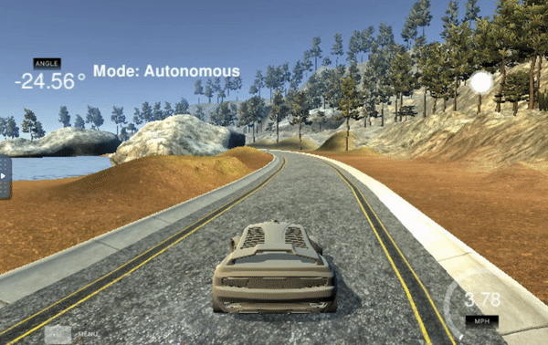
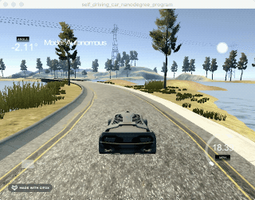
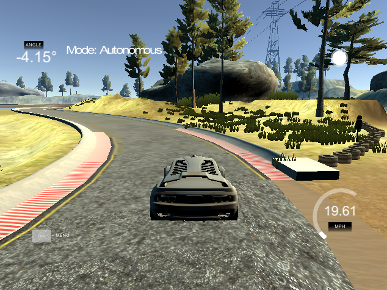

# PID controller optimization
---
## Project Goal
* Implement a PID controller in C++ to drive the vehicle around the track
* Use/Parse real-time the cross track error (CTE) and the velocity (mph) in order to compute the appropriate steering angle
* Drive SAFELY without any incidents like collision or falling off the track more than one lap
* Optimize hyperparameters in PID controller (Kp, Ki, Kd)

### Implementation Approach
####  Effect each of the P, I, D cofficients {Kp, Ki, Kd}
* Firstly, I manually set the PID coefficient sets {Kp_, Ki_, Kd_} = {1,0,0}, {0,1,0}, {0,0,1} to understand each one's effect took these three videos for each PID coefficient's impact by settingin like that.
* p_error is propotional to cte (cross track eror), i_error is accumulate all ctes , d_error is derivative of cte erros
* The total error gets = p_error_ * Kp_ + d_error_ * Kd_ + i_error_ * Ki_;
 shows the car is osciliating since Pk is same as current error value.
 shows the car is moving in one direction since Pd is difference of error values.
 shows the car is moving tangetiallly in one direction since Pi is accumulated error values.

#### Caveat of PID controller
PID controllers will calculate the error with respect to the present state, but the actuation will be performed when the vehicle is in a future state. This can  lead to instability , even cte value closes to or even hits over 1.5 at the same time steering_angle and speed value is changed to control, so that car does not fall off the road.
The PID controller could try to compute a control input based on a future error, but without a vehicle model it's unlikely this would be accurate.

#### Parameter Optimization Algorithm: Twiddle
There are multiple ways of hyperparameter tunning way like manual tuning, twiddle, Stochastic Gradient Descent(SGD). In this project, I applied the Twiddle algorithm since it is easy to implement for a PID controller. The twiddle algorithm is applied to find a best sets of P,I, D coefficients for PID Controller. In this project live crosstrack error is used for cost error function so that twiddle automatically helps the PID hyperparameters to keep trying the car on the track.

#### Car control
* Reading  steering angle and cte via WebSocket , and updated error using PID controll. With that, calculate total error and put it to steering_angle
* However, range is limited [-1,1] so that when cte is over 1.5 (half out of the lane) sets steer_value variable as -1 or 1
* Reading throttle and cte via WebSocket, and updated error using PID control.
* Dynamically adjusted the car speed based on the cte which adds to consistent driving. By using Throttle variable, I adjusted the car speed to slow down when the error grows, when error is stable in the small range than I make the car speed. 
* Set the range [0.05,0.3] for throttle value, if cte is over 1.5 then set the throttle as 0.05 and re-initialize P

### Result
* The vehicle must successfully drive a lap around the track. No tire left the drivable portion of the track surface. The car didn't collide any fense, pop up onto ledges or roll over any surfaces.
* For entire lap , car drove about 30 MPH for 2min per one lap in the simulation.

* around sharp corner, reduced speed to respond to delayed steering angle input

### Program Structure
#### PID.h/PID.cpp
Init()
Initialize PID coefficients (Kp, Ki, Kd) and PID errors (p_error, i_error, d_error)

UpdateError()
Update the PID error variables given cross track error.
* cte The current cross track error
 The ‌PID::UpdateError method calculates proportional, integral and derivative errors and the PID::TotalError calculates the total error using the appropriate coefficients.(Kp, Ki, Kd)
 p_error,  i_error, and  d_error in PID.h are the declaration variables in the class PID.
TotalError()
cte: predicted distance of the vehicle from the trajectory.
Calculate the total PID error: -tau_p * cte - tau_d * diff_cte - tau_i * int_cte
* output The total PID error
* steering = -tau_p * CTE - tau_d * diff_CTE - tau_i * int_CTE (same eq. for thorottle)
* where the integrated crosstrack error (int_CTE) is # the sum of all the previous crosstrack errors.
* prev_cte
by adding the prev_cte variable which is assigned to the previous CTE and diff_cte, the difference between the current CTE and previous CTE. We then put it all together with the new tau_d parameter to calculate the new steering value, -tau_p*cte - tau_d*diff_cte. This term works to cancel out steering drift.
With the integral term , keep track of all the previous CTEs, initially setting int_cte to 0 and then add the current cte term to the count int_cte += cte. lastly, update the steering value, -tau_p * cte - tau_d * diff_cte - tau_i * int_cte with tau_i parameter

#### main.cpp
Checks if the SocketIO event has JSON data.
 Initialize the pid variable.
 gets /reads a websocket message event: cte, speed, steering_angle
Calculate steering value , where steering value is [-1, 1]. If the steer_value is out of this range, set the value -1.0 or 1.0
 The steering angle value(steer_value)  is set to a value which returns from PID controller's TotalError()

#### hyperparameter tuning/optimization
For hyperparameter tunning, used Twiddle for hyperparameter tunning  by setting 'twiddle = true' . Got the idea from knowledge potal regarding to intialization value[Kp, Ki, Kd] and partial derivative[dPk, dPi, dPd] value.
Like Lesson [Pk, Pd values are selected for bigger magnitude comapre to Ki since accumulated error should be very small.
Once best [Pk, Pi, Pd] values are consistenly chosen by Twiddle algorithm then , set 'twiddle = false'.
After getting best P cofficients continuosly from Twiddle, then it's going to be final parameters.

##### json.hpp: JSON for Modern C++ v2.1.1 [referrence](https://github.com/nlohmann/json)
---
## Dependencies
* cmake >= 3.5
* gcc/g++ >= 5.4
* [uWebSockets](https://github.com/uWebSockets/uWebSockets)
* Simulator. [download page](https://github.com/udacity/self-driving-car-sim/releases)

## Code Style
[Google's C++ style guide](https://google.github.io/styleguide/cppguide.html).

